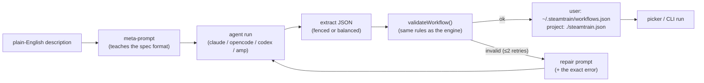

# Creating workflows with LLM delegation

steamtrain can **draft a workflow for you**: describe what you want in plain
English and an agent (Claude / OpenCode / Codex / Amp) writes a valid
[`WorkflowSpec`](workflow-spec.md), which steamtrain validates with the exact
rules the engine enforces at run time before you ever run it.

This is the inverse of hand-authoring JSON: you delegate the *structure* to a
model, then review, save, and run it like any bundled workflow.



## Where workflows are saved: scope

Authoring writes to one of two layers, selectable everywhere (CLI, TUI, web):

- **user** (default) — `~/.steamtrain/workflows.json`, your personal catalog,
  available in every project on the machine.
- **project** — the `workflows` section of the project's `./steamtrain.json`,
  so the workflow can be committed to the repo and shared with your team.
  Project entries win over user, which win over bundled.

Project writes are read-modify-write: only the `workflows` section is touched,
and all other config keys (`binaries`, `timeoutMs`, `maxConcurrency`) are
preserved. The same scope applies to clone and delete. Authoring targets the
**same** `steamtrain.json` the process loaded, so `--config-file <path>` is
honored (the workflow is written to that file, not the working directory's).
The live catalog re-reads the project layer through the engine's own config
loader, so what you see after a write matches a fresh run exactly.

## CLI: `steamtrain workflow create`

```bash
# Draft and print the workflow (does not save).
steamtrain workflow create --input "review a PR from three angles then merge findings"

# Choose the drafting agent/model and save it to the user catalog.
steamtrain workflow create \
  --input "audit the auth module for security and error-handling bugs" \
  --agent claude --model claude-sonnet-4-6 \
  --name auth-audit --save

# Save into the project's ./steamtrain.json so it can be committed and shared.
steamtrain workflow create \
  --input "team release checklist" --name release-check \
  --save --scope project

# Machine-readable output for scripting.
steamtrain workflow create --input "..." --json
```

| flag | default | meaning |
| --- | --- | --- |
| `--input <text>` / `--stdin` | — | the description (required) |
| `--agent <id>` | `opencode` | which agent drafts the workflow |
| `--model <model>` | `opencode/qwen3.6-plus-free` for opencode | model in the agent's own format |
| `--effort <e>` | — | reasoning effort / variant |
| `--name <name>` | derived from the description | slugified workflow name |
| `--save` | off | persist to the chosen scope |
| `--scope <user\|project>` | `user` | target layer; `--project` is shorthand for `--scope project` |
| `--json` | off | emit `{ ok, spec, … }` instead of human text |

Without `--save`, the JSON is printed so you can paste it into a `steamtrain.json`
`workflows` map or a `workflows.json` file yourself. With `--save`, the workflow
appears immediately in `steamtrain workflow list` and the TUI picker, tagged as a
`user` (or `project`) workflow.

The default agent is OpenCode on a **free** Zen model, so creation works without
paid provider credentials.

## TUI: `/createworkflow`

In the TUI (workflow mode), the workflow picker always ends with a selectable
**`+ Create a new workflow…`** row. Three ways to start a draft:

- Highlight that row with ↑/↓ and press `Enter`.
- Press `Ctrl+N` from anywhere on the picker.
- Type the `/createworkflow` command yourself.

The first two prefill the prompt with `/createworkflow ` (carrying any plain text
you already typed) and focus it, so you finish the description and press `Enter`
to run it — one extra keystroke than typing the command directly, but nothing to
memorize. When no workflows exist yet, the create row is the only thing on
screen.

```
/createworkflow review the checkout service for race conditions, then report
```

steamtrain picks the first doctor-healthy agent (preferring OpenCode's free
model), shows a live **create workflow** panel with the model's streamed output,
validates the result, saves it to your user catalog, and selects it in the
picker — ready to run. Press `Esc` to cancel an in-flight draft or dismiss the
panel.

### Choosing the drafting model

The effective drafting agent · model is shown in the workflow picker header
(`draft: …`, tagged `(auto)` when it's the automatic pick). To override it, use
`/model` while on the picker (no step selected):

```
/model claude                      # that agent's default draft model
/model claude claude-sonnet-4-6    # an explicit agent + model
/model opencode/mimo-v2.5-free     # a bare model id (agent inferred)
/model                             # show the current target + options
/model auto                        # clear the override, back to auto-pick
```

The override is session-only and only accepts a **doctor-healthy** agent (a
draft spawns a real CLI). It's the same `/model` you use on a selected workflow
step or a workspace tab — the target just depends on where you are.

Add `--project` to save into the project's `./steamtrain.json` instead:

```
/createworkflow --project team release checklist with sign-off gate
```

The same flag works for cloning (`/cloneworkflow --project <new-name>`), and
`/deleteworkflow <name>` removes either a user or a project workflow.

## How robust is extraction?

Models often wrap JSON in prose or ```json fences. The extractor:

1. prefers the contents of the first fenced code block, then
2. scans for the first **balanced** top-level `{ … }` (string/escape aware), then
3. `JSON.parse`s it, then
4. checks the shape with `workflowSpecSchema`, then
5. runs the full `validateWorkflow` (cross-phase dependency rules, step budget).

If any step fails, `create` exits non-zero (CLI) or shows the error plus the raw
model output (TUI) — it never saves an invalid workflow.

### Auto-repair

Before surfacing a failure, the generator gives the model a chance to fix its own
mistake. When a draft doesn't parse or fails validation, it re-prompts the same
agent with the original request **plus the exact validation error and the prior
output**, asking it to fix only what the error names. This runs up to two retries
(three agent runs total), so the common slip — two dependent steps placed in the
same phase — is usually corrected automatically without you seeing it. The result
reports `attempts` (1 = the first draft was already valid).

## Loops

For iterative work — "review then fix then re-review until clean" — a workflow
can use a **loop-back gate**: a `gate` step whose `loopTo` names an **earlier**
phase id, plus an optional `maxIterations`:

```jsonc
{ "id": "loop-gate", "kind": "gate", "dependsOn": ["review"],
  "condition": { "step": "review", "contains": "DONE" },
  "loopTo": "review", "maxIterations": 5, "onFalse": "continue" }
```

Semantics:

- **condition true** → the loop converged; execution continues forward past the gate.
- **condition false and iterations remain** → execution jumps back to the
  `loopTo` phase and re-runs every phase from there through the gate again.
- **condition false and the cap is hit** → `onFalse` applies (`continue` / `fail`
  / `stop`), same as a non-looping gate.

Rules enforced by `validateWorkflow` (the same rules the meta-prompt teaches the
drafting model):

- the gate must live in a phase **after** the phases it re-runs;
- `loopTo` must name an earlier-or-equal phase — loops only go backward;
- `maxIterations` defaults to 10 (`DEFAULT_LOOP_MAX_ITERATIONS`) when omitted,
  and is capped at 100 (`LOOP_MAX_ITERATIONS_CEILING`); a project-level
  `loopMaxIterations` config value can change the default;
- loop regions must be cleanly nested or disjoint — never partially overlapping.

Each pass through the loop body sees the current pass number via the
`{{iteration}}` template (1-based), so a prompt can say "pass {{iteration}}" or
adjust behavior on later iterations.

### Cost note

A loop **re-runs every step in its body on each pass** — there is no cross-
iteration caching, so the real subprocess / LLM cost multiplies by the number
of iterations that actually run (up to `maxIterations`). A `forEach` inside a
loop body multiplies further (fan-out × iterations). Keep `maxIterations` small
(≤ 5 is a good rule of thumb when each body step costs more than a few cents),
and use `{{iteration}}` to let the model bail early when the work is done
before the cap. The static step budget in `validateWorkflow` guards against
pathological expansion but does **not** estimate dollar cost.

The bundled `review-loop` workflow (`steamtrain workflow run review-loop`) is a
worked example: implement → review (replies `DONE` when clean) → fix → a gate
that loops back to `review` until it reports `DONE` or 5 iterations pass. The
LLM workflow author (`steamtrain workflow create`) also knows this pattern —
describing iterative work like "review and fix until clean" will draft a
loop-back gate instead of unrolling a fixed chain of phases.

## Validation guarantees

A generated workflow is held to the same bar as a hand-written one:

- every step id is unique;
- `dependsOn`, gate `condition.step`, and `forEach` may only reference steps in
  an **earlier** phase (phases are sequential; same-phase steps are parallel);
- agent-backed steps must set `agent`, `model`, and a non-empty `prompt`;
- the workflow fits within the step/concurrency budgets.

See [`workflow-overview.md`](workflow-overview.md) for the execution model and
[`workflow-spec.md`](workflow-spec.md) for field-by-field syntax.
