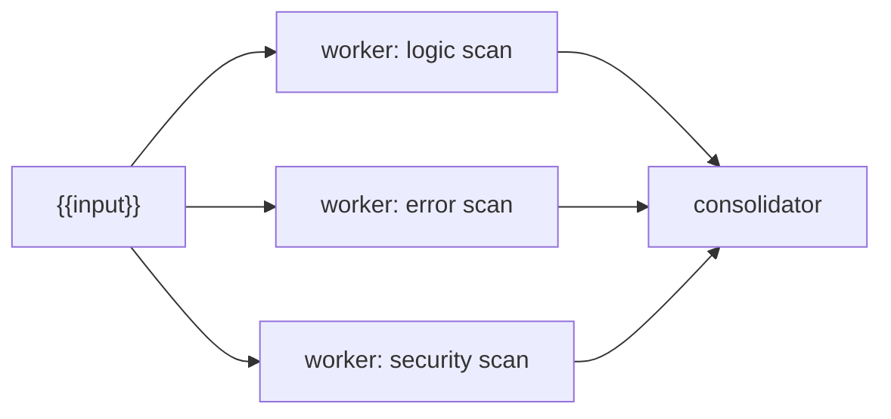
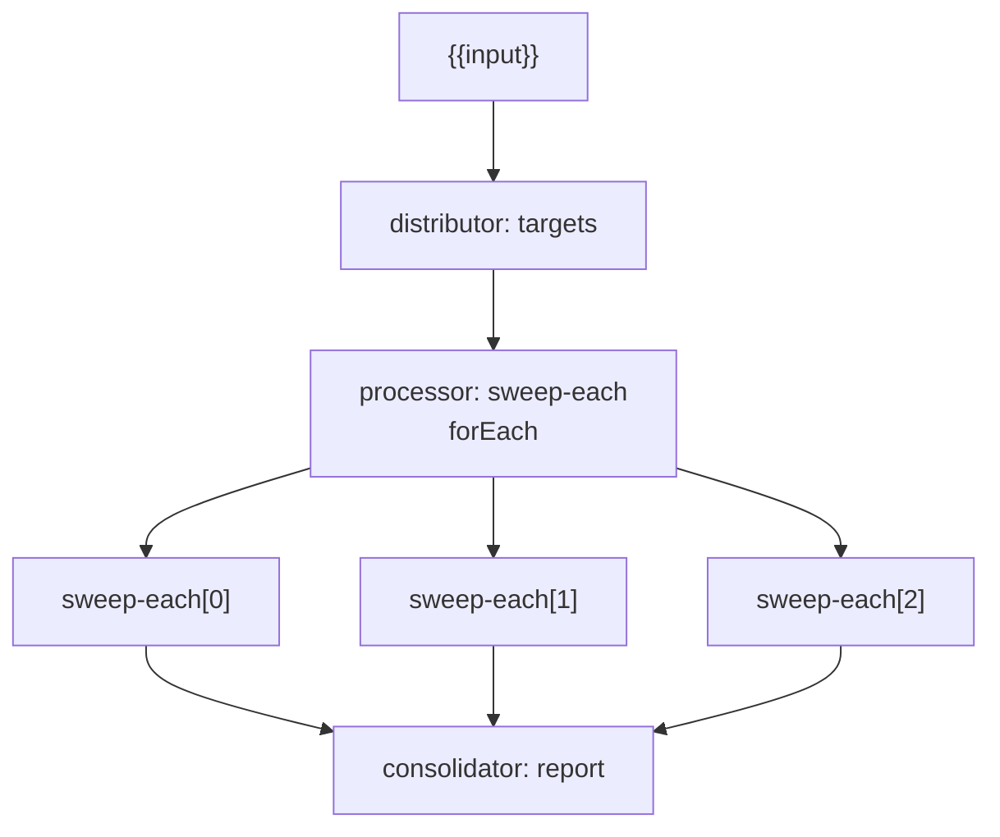
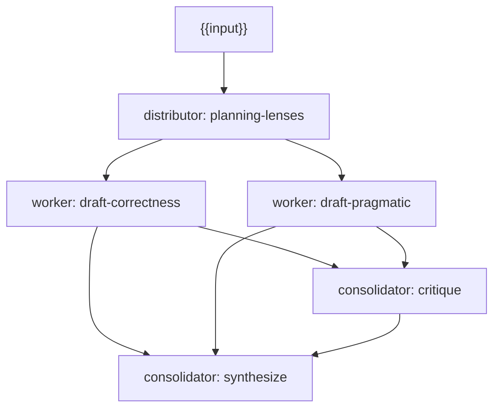
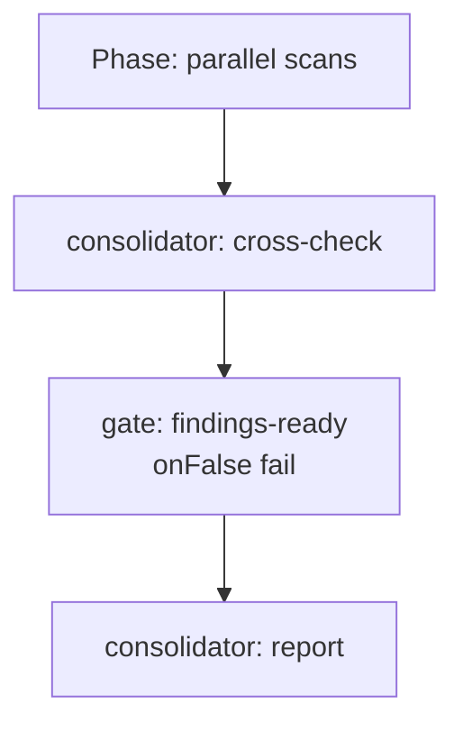
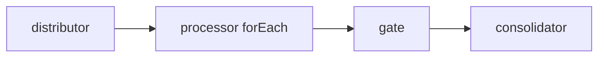

# Workflow examples and patterns

This document walks through real workflow patterns in steamtrain, including the
bundled workflows and common authoring recipes.

For syntax tables, see [`workflow-spec.md`](workflow-spec.md). For the execution
model and diagrams, see [`workflow-overview.md`](workflow-overview.md).

---

## Pattern index

| pattern | blocks used | bundled example |
| --- | --- | --- |
| parallel independent workers | multiple workers in one phase | `bug-hunt` scan phase |
| static fan-out + dynamic processing | distributor + `forEach` processor | `target-sweep` |
| distribute lenses + parallel drafts | distributor + workers | `multi-plan` |
| cross-check + gate + report | consolidator + gate + consolidator | `bug-hunt` |
| audit many repos/services | distributor + `forEach` + gate | README `audit` example |
| compose another workflow as one stage | `workflow` step | `release` |
| plan → parallel streams → staged merge → PR | `workflow` forEach + merge `mode: "worktree"` + `attach:` | `mainline` |

---

## Pattern 1: parallel independent workers

Use when you want a **fixed, small** number of branches with different prompts
or models, all starting from the same input.



### Spec sketch

```jsonc
{
  "phases": [
    {
      "id": "scan",
      "title": "Parallel scans",
      "steps": [
        { "id": "logic", "kind": "worker", "agent": "claude", "model": "…", "prompt": "Find logic bugs in {{input}}" },
        { "id": "errors", "kind": "worker", "agent": "opencode", "model": "…", "prompt": "Find error-handling bugs in {{input}}" },
        { "id": "security", "kind": "worker", "agent": "claude", "model": "…", "prompt": "Find security issues in {{input}}" }
      ]
    },
    {
      "id": "merge",
      "title": "Merge",
      "steps": [
        {
          "id": "merge",
          "kind": "consolidator",
          "dependsOn": ["logic", "errors", "security"],
          "agent": "claude",
          "model": "…",
          "prompt": "Merge:\n{{steps.logic.output}}\n{{steps.errors.output}}\n{{steps.security.output}}"
        }
      ]
    }
  ]
}
```

### When to prefer this over `forEach`

- you need **different models** per branch
- you need **different prompts** per branch, not just different item text
- fan-out count is small and fixed (2–4 branches)

---

## Pattern 2: static distributor + dynamic `forEach`

Use when you have **many similar work items** and want one generated agent run
per item.



### Bundled walkthrough: `target-sweep`

Phase 1 — distribute target areas:

```jsonc
{
  "id": "targets",
  "kind": "distributor",
  "items": [
    "implementation concerns for {{input}}",
    "test coverage concerns for {{input}}",
    "documentation and rollout concerns for {{input}}"
  ]
}
```

Phase 2 — one processor per item:

```jsonc
{
  "id": "sweep-each",
  "kind": "processor",
  "dependsOn": ["targets"],
  "forEach": "steps.targets.items",
  "agent": "claude",
  "model": "claude-sonnet-4-6",
  "prompt": "Analyze target {{item.index}}:\n{{item}}\n\nTask: {{input}}"
}
```

Phase 3 — consolidate aggregate parent output:

```jsonc
{
  "id": "report",
  "kind": "consolidator",
  "dependsOn": ["sweep-each"],
  "agent": "claude",
  "model": "claude-sonnet-4-6",
  "prompt": "{{steps.sweep-each.output}}"
}
```

Run it:

```bash
steamtrain workflow run target-sweep --input "add workflow documentation"
```

---

## Pattern 3: distribute lenses, then parallel specialized workers

Use when you want a **shared framing** step before parallel work, without
dynamic child ids.

### Bundled walkthrough: `multi-plan`



Phase 1 distributes planning lenses (static items).

Phase 2 runs two workers in parallel. Both read
`{{steps.planning-lenses.items}}` in their prompts but produce different plans.

Phase 3 critiques both drafts with an agent-backed consolidator.

Phase 4 synthesizes the final plan from both drafts + critique.

This differs from `target-sweep` because phase 2 uses **explicit parallel
workers**, not `forEach`.

---

## Pattern 4: cross-check, gate, then report

Use when you want a quality bar before spending tokens on a final report.

### Bundled walkthrough: `bug-hunt`



1. **Scan phase** — three parallel workers hunt different bug classes.
2. **Cross-check** — one consolidator merges and filters false positives.
3. **Gate** — fails and stops if cross-check did not succeed.
4. **Report** — final prioritized report consolidator.

Gate step:

```jsonc
{
  "id": "findings-ready",
  "kind": "gate",
  "dependsOn": ["cross-check"],
  "condition": { "step": "cross-check", "ok": true },
  "target": "verified-findings",
  "onFalse": "fail"
}
```

If cross-check fails:

- gate is skipped or evaluates false
- report phase does **not** run
- workflow ends with `ok: false`

---

## Pattern 5: per-service audit with gate

From the README example — good template for repo/service fan-out.



Key details:

- `cwd` on the processor is shared; if each target needs a different directory,
  use explicit parallel workers instead of `forEach`
- gate uses `onFalse: "fail"` to avoid reporting when scans fail
- report references `{{steps.audit-each.output}}`, not child ids

---

## Pattern 6: agent-backed distributor

Use when the **split itself** should be model-driven.

```jsonc
{
  "id": "split",
  "kind": "distributor",
  "agent": "claude",
  "model": "claude-sonnet-4-6",
  "prompt": "Split this task into separate review areas, one per line, no numbering:\n{{input}}"
}
```

Downstream:

```jsonc
{
  "id": "review-each",
  "kind": "processor",
  "dependsOn": ["split"],
  "forEach": "steps.split.items",
  "agent": "claude",
  "model": "claude-sonnet-4-6",
  "prompt": "Review area:\n{{item}}"
}
```

Caveats:

- static validation cannot know how many lines the agent will emit
- runtime enforces the 1000-step cap before spawning children
- ask the splitter for **one item per line** to make parsing reliable

---

## Pattern 7: soft gate vs hard gate

### Soft gate — annotate but continue

```jsonc
{
  "id": "maybe-ready",
  "kind": "gate",
  "dependsOn": ["report"],
  "condition": { "step": "report", "contains": "P0" },
  "target": "has-critical",
  "onFalse": "continue"
}
```

Use when later phases should still run even if the condition is false.

### Hard gate — fail workflow and stop

```jsonc
{
  "id": "must-pass",
  "kind": "gate",
  "dependsOn": ["checks"],
  "condition": { "step": "checks", "ok": true },
  "target": "ready",
  "onFalse": "fail"
}
```

### Early successful stop

```jsonc
{
  "id": "nothing-to-do",
  "kind": "gate",
  "dependsOn": ["scan"],
  "condition": { "step": "scan", "contains": "no findings" },
  "target": "clean",
  "onFalse": "stop"
}
```

`stop` ends the workflow successfully without running later phases.

---

## Pattern 8: pure merge without an agent

Use when you only need structured concatenation, not synthesis.

```jsonc
{
  "id": "bundle",
  "kind": "consolidator",
  "dependsOn": ["a", "b", "c"]
}
```

Default output:

```text
--- a ---
...

--- b ---
...

--- c ---
...
```

Add a `prompt` if you want a template-shaped merge without spawning an agent.

---

## Pattern 9: compose another workflow as one stage

Use when a proven workflow (e.g. `bug-hunt`) should be embedded as one stage
of a bigger pipeline, instead of being copy-pasted or hand-unrolled into the
new spec.

### Bundled walkthrough: `release`

```jsonc
{
  "name": "release",
  "description": "Release checklist that runs the bug-hunt sweep as one of its stages.",
  "phases": [
    {
      "id": "checks",
      "title": "Checks",
      "steps": [
        {
          "id": "bug-sweep",
          "kind": "workflow",
          "workflow": "bug-hunt",
          "input": "{{input}} — pre-release sweep"
        }
      ]
    },
    {
      "id": "gate",
      "title": "Gate",
      "steps": [
        {
          "id": "clean",
          "kind": "gate",
          "dependsOn": ["bug-sweep"],
          "condition": { "step": "bug-sweep", "ok": true },
          "onFalse": "fail"
        }
      ]
    }
  ]
}
```

`bug-sweep`'s internal phases and steps show up in
`steamtrain workflow history show <id>` namespaced as `bug-sweep::<step>`
(e.g. `bug-sweep::cross-check`, `bug-sweep::report`) — the child run's event
stream folds into this run's own history rather than appearing as a separate
run. The gate then routes on `bug-sweep`'s own `ok`, exactly as it would for
any other step.

## Pattern 10: plan → parallel sub-pipeline streams → staged merge → PR

Use when the task is too big for one pass but decomposes into independent
chunks, each of which needs its OWN implement→review→fix→test loop, and the
combined result needs one more review pass before delivery. This is the
bundled `mainline` workflow's shape — a `workflow` call step with `forEach`
running a whole child pipeline per stream, `merge` in `mode: "worktree"` to
stage the combined result, then `workspace: "attach:"` to keep working on it.

```jsonc
{
  "name": "plan-and-integrate",
  "phases": [
    { "id": "plan", "steps": [
      { "id": "plan", "kind": "distributor", "agent": "opencode", "model": "…",
        "itemsPath": "streams",
        "prompt": "Split into independent streams…",
        "output": { "type": "object", "required": ["streams"],
          "properties": { "streams": { "type": "array",
            "items": { "type": "object", "required": ["title", "charter"],
              "properties": { "title": { "type": "string" }, "charter": { "type": "string" } } } } } } }
    ] },
    { "id": "streams", "steps": [
      { "id": "streams", "kind": "workflow", "workflow": "mainline-stream",
        "dependsOn": ["plan"], "forEach": "steps.plan.items", "input": "{{item}}",
        "outputStep": "review", "worktreeStep": "implement" }
    ] },
    { "id": "integrate", "steps": [
      { "id": "integrate", "kind": "merge", "from": ["streams"],
        "mode": "worktree", "onConflict": "agent", "agent": "opencode", "model": "…" }
    ] },
    { "id": "final-review", "steps": [
      { "id": "final-review", "agent": "opencode", "model": "…",
        "dependsOn": ["integrate"], "workspace": "attach:integrate",
        "prompt": "Review the full merged diff from base." }
    ] },
    { "id": "deliver", "steps": [
      { "id": "deliver", "kind": "merge", "from": ["integrate"], "mode": "pr",
        "dependsOn": ["final-review"],
        "prTitle": "{{input}}", "prBody": "Streams: {{steps.plan.items}}" }
    ] }
  ]
}
```

`streams` fans out one whole `mainline-stream` run per planned item; each
child's `worktreeStep: "implement"` makes the fan-out parent surface one
worktree per stream, so `integrate`'s `from: ["streams"]` harvests all of
them. `mode: "worktree"` keeps the merge result as a worktree instead of
delivering it, so `final-review` can `attach:integrate` and inspect (and, in
the full `mainline` workflow, fix) the COMBINED diff before the real
delivery merge. See [`mainline-pipeline.md`](mainline-pipeline.md) for the
full bundled version — planning, per-stream loops, the final loop, PR
delivery, and issue filing all wired together.

---

## Authoring checklist

Before running a new workflow:

1. **Phases** — does every consumer of prior output live in a later phase?
2. **Fan-out** — fixed parallel workers or `distributor` + `forEach`?
3. **Dependencies** — does every `dependsOn` reference an earlier phase?
4. **Gates** — is `onFalse` `continue`, `fail`, or `stop` intentional?
5. **Cost** — how many agent runs will this spawn on a realistic input?
6. **Validation** — `steamtrain workflow validate <name>`
7. **Dry run** — start with a tiny input in the TUI or CLI

---

## Testing workflows locally

### The $0 tour

Before anything else, the bundled `tour` workflow exercises most of the
engine — a distributor, parallel `command` steps, a `when` skip, a loop-back
gate driven by `{{iteration}}`, and an agentless consolidator — without
spawning a single agent:

```bash
steamtrain workflow run tour --input "all aboard"
```

It is also a useful smoke test for a new install or a CI environment: it runs
with zero credentials and exits non-zero only if the engine itself is broken.
Read its spec in `src/workflow/bundled.ts` — every block it rides is a pattern
from this document, in agentless form.

### TUI

```bash
bun src/index.tsx
```

1. pick workflow
2. enter a small input
3. watch the phase → step tree
4. drill into generated child steps for `forEach` processors

### CLI

```bash
steamtrain workflow list
steamtrain workflow validate my-workflow
steamtrain workflow run my-workflow --input "small test scope"
steamtrain workflow run my-workflow --input "small test" --json
```

### Resume behavior test

1. start a workflow
2. cancel with `Esc` mid-run
3. re-run with the **same** input → cached steps replay
4. change the input → a different cache file is used (old file remains on disk)

---

## Related docs

- [`workflow-overview.md`](workflow-overview.md)
- [`workflow-spec.md`](workflow-spec.md)
- [`../README.md`](../README.md)
