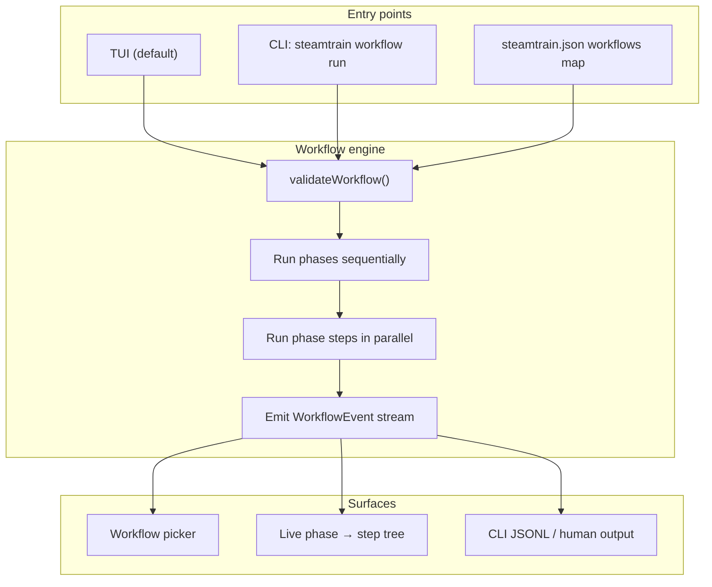
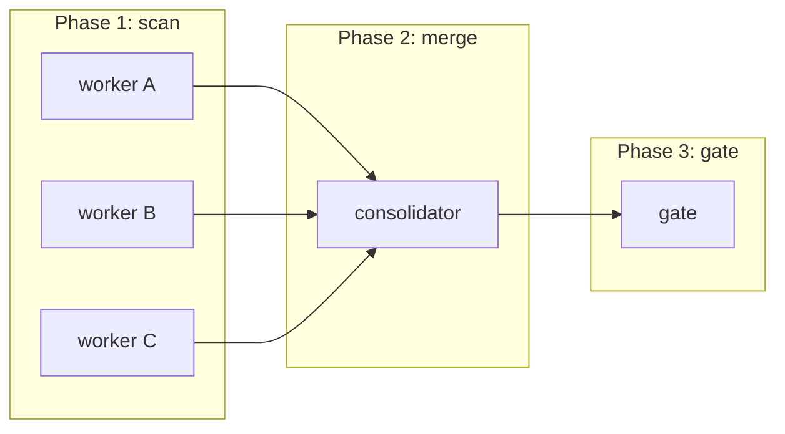
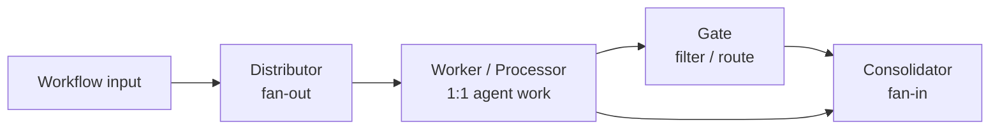
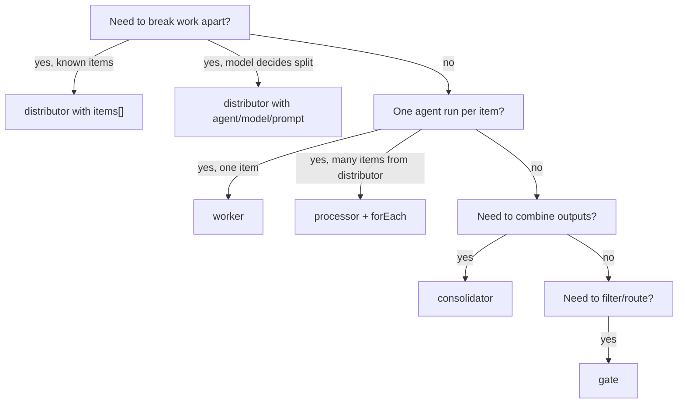
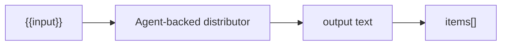
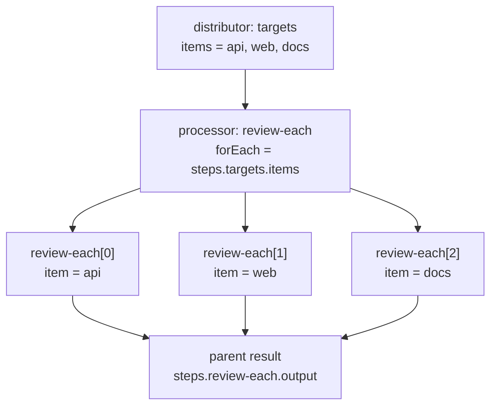
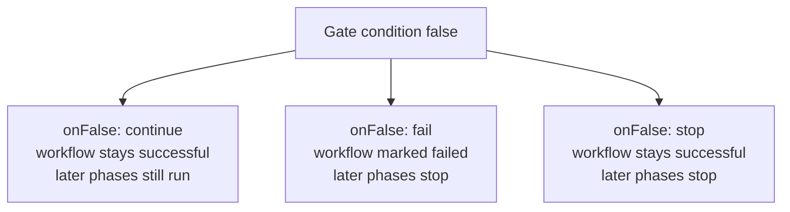
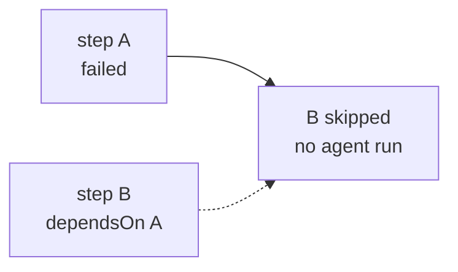
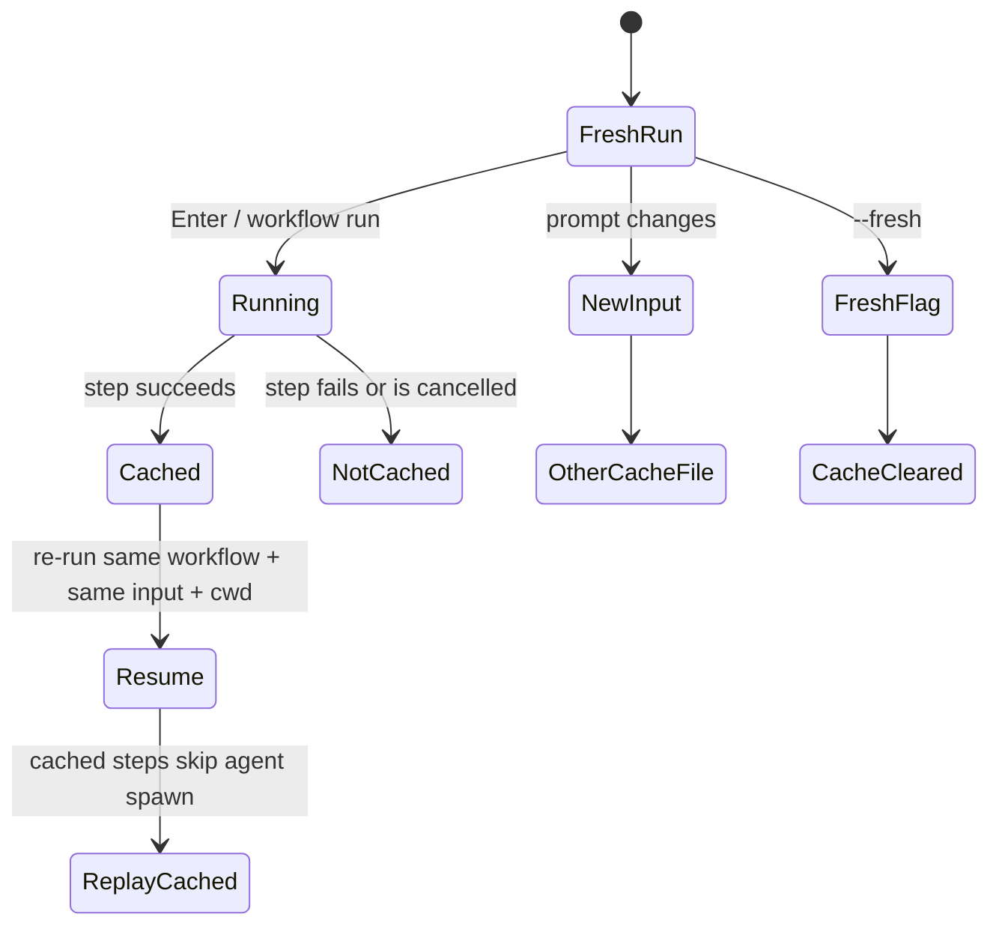
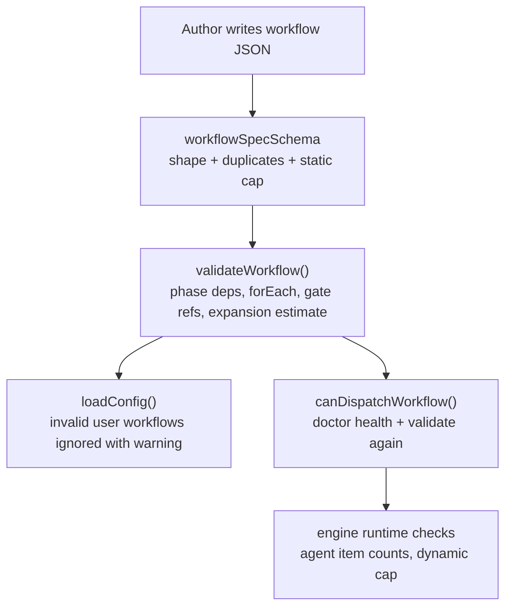

# Workflow overview

This guide explains how steamtrain workflows work as a system: the execution
model, building blocks, dynamic fan-out, gates, dependencies, resume behavior,
and how the TUI/CLI surface it.

For field-by-field syntax, see [`workflow-spec.md`](workflow-spec.md). For copy-paste
patterns and bundled workflow walkthroughs, see [`workflow-examples.md`](workflow-examples.md).

---

## What is a workflow?

A workflow is a declarative JSON program made of **phases**. Each phase contains
one or more **steps**. steamtrain turns those steps into agent runs, pure data
transforms, and routing decisions.



Workflows are the **primary** orchestration surface in steamtrain. Task modes
(`plan`, `implement`, `review`) still exist, but workflow mode is the default
when you launch the TUI.

---

## Execution model

### Phases are sequential

Phases run one after another. Phase 2 does not start until every step in phase 1
has settled (success, failure, skip, or cancel).

### Steps in a phase are parallel

All steps in the same phase are scheduled together, bounded by `maxConcurrency`
(default 5, hard cap 16). There is **no guaranteed order** among steps in the
same phase.

When a step's target directory is inside a git repository, each agent-backed step
runs in its own git worktree. Parallel workers and `forEach` children therefore
do not edit the same checkout. The workflow's cache and history still use the
launch cwd; only the agent subprocess cwd is remapped into the isolated
worktree.



ASCII equivalent:

```text
Phase 1 ── parallel ──┬─ step A
                      ├─ step B
                      └─ step C
         │
         ▼
Phase 2 ── parallel ──┬─ step D
         │
         ▼
Phase 3 ── ...
```

### Implication: same-phase template references are unsafe

Because parallel steps start together, a step in phase 1 must **not** assume
another step in phase 1 has already produced output. This is invalid in practice
even if you avoid `dependsOn`:

```jsonc
// BAD: both steps are in the same phase
{
  "id": "p1",
  "steps": [
    { "id": "draft", "prompt": "{{input}}" },
    { "id": "summary", "prompt": "{{steps.draft.output}}" }  // often empty
  ]
}
```

Use a later phase for anything that reads another step's output.

### Agent worktree isolation

Agent-backed workers, processors, distributors, and consolidators run from an
isolated git worktree whenever their resolved `cwd` is inside a git repository
with a valid `HEAD`. The worktree is created from the current commit on a unique
`steamtrain/...` branch, then steamtrain snapshots tracked dirty changes and
untracked non-ignored files into it before the agent starts. Ignored runtime
entries such as `.env` or `node_modules/` are linked into the worktree so local
commands see the same runtime context without sharing tracked source edits. If a
step sets `cwd` to a subdirectory, the agent lands in the matching subdirectory
of its worktree.

Worktrees are retained after the run so agent-created files can be inspected,
committed, or merged from their `steamtrain/...` branches. Completed agent step
results include the worktree cwd, root, branch, and linked ignored paths.

Directories outside git repositories keep the previous behavior and run in the
resolved `cwd`.

---

## Building blocks

Workflows are composed from five block kinds.



| kind | role | spawns agents? | typical use |
| --- | --- | --- | --- |
| `distributor` | split one input into many items | optional | task areas, targets, lenses |
| `worker` / `processor` | one agent run per work item | yes | review, implement, analyze |
| `gate` | evaluate a condition, emit state | no | readiness checks, quality bars |
| `consolidator` | merge prior outputs | optional | reports, synthesis, dedupe |

Steps without `kind` are treated as `worker` blocks for backward compatibility.

### When to use which block



---

## Distributors

A distributor turns one workflow input into **multiple item payloads**.

### Static distributor

```jsonc
{
  "id": "targets",
  "kind": "distributor",
  "items": ["api: {{input}}", "web: {{input}}"]
}
```

After execution:

| field | value |
| --- | --- |
| `steps.targets.items` | `["api: …", "web: …"]` |
| `steps.targets.output` | items joined by newline |

Empty/whitespace-only items are trimmed and dropped. A distributor that ends up
with zero items fails.

### Agent-backed distributor

```jsonc
{
  "id": "split",
  "kind": "distributor",
  "agent": "claude",
  "model": "claude-sonnet-4-6",
  "prompt": "Split this task into separate review areas, one per line:\n{{input}}"
}
```

The agent's final text output is split on non-empty lines and stored as `items`.
This is useful when the split itself should be model-driven.



---

## Workers and processors

A `worker` runs **one** agent against **one** prompt.

A `processor` is an alias for `worker`. Use `processor` when the step is part of
a processing pipeline; use `worker` for general agent work.

### Single worker

```jsonc
{
  "id": "review",
  "kind": "worker",
  "agent": "claude",
  "model": "claude-sonnet-4-6",
  "prompt": "Review {{input}}"
}
```

---

## Dynamic fan-out (`forEach`)

This is the most important advanced feature.

A processor with `forEach` does **not** run once. Instead, the engine:

1. reads items from a prior **distributor** step
2. creates generated child step ids: `review-each[0]`, `review-each[1]`, …
3. runs one agent per item
4. stores an **aggregate parent result** under the declared step id



### Spec

```jsonc
{
  "id": "review-each",
  "kind": "processor",
  "agent": "claude",
  "model": "claude-sonnet-4-6",
  "dependsOn": ["targets"],
  "forEach": "steps.targets.items",
  "prompt": "Review target {{item.index}}:\n{{item}}"
}
```

### Runtime tree in the TUI

```text
review-each
  review-each[0]  api
  review-each[1]  web
  review-each[2]  docs
```

### What downstream steps should reference

| reference | meaning |
| --- | --- |
| `{{steps.review-each.output}}` | aggregate of all child outputs |
| `{{steps.review-each.items}}` | original item list |
| `{{steps.review-each.ok}}` | `true` only if every child succeeded |
| `{{steps.review-each[0].output}}` | not supported — use the parent aggregate |

Inside a `forEach` prompt:

| placeholder | meaning |
| --- | --- |
| `{{item}}` / `{{item.value}}` | current item text |
| `{{item.index}}` | zero-based item index |
| `{{item.sourceStepId}}` | distributor step id |

### Rules and limits

- `forEach` source must be a **distributor** in an **earlier phase**
- source distributor must succeed (`ok: true`)
- total static + generated steps cannot exceed **1000**
- child runs respect `maxConcurrency`

### Static vs dynamic fan-out

| approach | when to use |
| --- | --- |
| multiple explicit workers in one phase | fixed small fan-out, different prompts/models per branch |
| `distributor` + `forEach` processor | many items, same processor template, generated child ids |

Example of explicit parallel workers:

```jsonc
{
  "id": "draft",
  "steps": [
    { "id": "draft-a", "agent": "claude", "model": "…", "prompt": "…" },
    { "id": "draft-b", "agent": "opencode", "model": "…", "prompt": "…" }
  ]
}
```

Example of dynamic fan-out:

```jsonc
{
  "id": "process",
  "steps": [
    {
      "id": "review-each",
      "kind": "processor",
      "forEach": "steps.targets.items",
      "agent": "claude",
      "model": "…",
      "prompt": "{{item}}"
    }
  ]
}
```

---

## Consolidators

A consolidator merges prior outputs.

### Pure consolidator

Without an agent, it either:

- renders its `prompt` template, or
- emits a default sectioned merge of `dependsOn` outputs

```jsonc
{
  "id": "report",
  "kind": "consolidator",
  "dependsOn": ["review-api", "review-web"]
}
```

Default output shape:

```text
--- review-api ---
...

--- review-web ---
...
```

### Agent-backed consolidator

```jsonc
{
  "id": "report",
  "kind": "consolidator",
  "dependsOn": ["review-each"],
  "agent": "claude",
  "model": "claude-opus-4-8",
  "prompt": "Merge into one report:\n{{steps.review-each.output}}"
}
```

Use this when synthesis itself should be model-driven.

---

## Gates

A gate evaluates a condition and emits a **target/state label**. Gates do not
spawn agents.

```jsonc
{
  "id": "ready",
  "kind": "gate",
  "dependsOn": ["report"],
  "condition": { "step": "report", "ok": true },
  "target": "verified",
  "onFalse": "fail"
}
```

### Condition fields (ANDed together)

| field | checks |
| --- | --- |
| `step` | which earlier step to inspect (required when using `ok`) |
| `ok` | referenced step success/failure |
| `contains` | substring match |
| `matches` | regex match |
| `equals` | exact match |
| `not` | invert final result |

If `step` is omitted, text conditions apply to the **workflow input**.

### `onFalse` behavior

This is easy to misunderstand, so treat it as a routing decision:



| `onFalse` | workflow `ok` | later phases run? | typical use |
| --- | --- | --- | --- |
| `continue` | stays `true` | yes | soft filter / annotate only |
| `fail` | becomes `false` | no | hard quality bar |
| `stop` | stays `true` | no | early exit without marking failure |

---

## Dependencies (`dependsOn`)

`dependsOn` serves two roles:

1. **documentation / intent** — this step logically follows those steps
2. **execution gating** — if any referenced earlier step failed, this step is
   skipped



Skipped step result:

```text
skipped: dependency 'A' failed
```

Rules:

- `dependsOn` may only reference steps in **earlier phases**
- same-phase dependencies are rejected by validation
- gates with `dependsOn` on failed steps are skipped; if the gate uses
  `onFalse: fail` or `onFalse: stop`, later phases stop

---

## Templates

Templates are rendered into prompts and some gate/distributor fields.

### Workflow input

| placeholder | expands to |
| --- | --- |
| `{{input}}` | text supplied at run time |
| `{{args}}` | alias for `{{input}}` |

### Prior step results

| placeholder | expands to |
| --- | --- |
| `{{steps.<id>.output}}` | step output text |
| `{{steps.<id>.items}}` | distributor items joined by newline |
| `{{steps.<id>.ok}}` | `true` or `false` |
| `{{steps.<id>.error}}` | error text, if any |
| `{{steps.<id>.target}}` | gate target label |

### Dynamic fan-out item context

| placeholder | expands to |
| --- | --- |
| `{{item}}` | current item value |
| `{{item.value}}` | same as `{{item}}` |
| `{{item.index}}` | zero-based index |
| `{{item.sourceStepId}}` | distributor step id |

Unknown placeholders are left unchanged.

---

## Resume and cache behavior

steamtrain caches successful step results in memory and on disk under
`.steamtrain/cache/` (keyed by workflow name, input, and launch cwd). Successful
steps replay without spawning an agent on a later run in the same session **or**
after restarting steamtrain.



Behavior:

- successful steps are cached under their step id (memory + disk)
- cancelled steps are **not** cached
- failed steps are **not** cached
- dynamic child steps cache individually (`review-each[0]`, etc.)
- parent dynamic steps cache their aggregate + `childResults`
- a different prompt uses a different on-disk cache file automatically
- editing the workflow JSON (or upgrading steamtrain with changed bundled workflows)
  invalidates the cache via a `specHash` check — stale files are ignored
- re-running with the same prompt replays all cached successful steps and runs the rest
- each successful `step_done` writes the full in-memory cache to disk (partial phase
  snapshots are normal and resume correctly)
- parallel runs of the same workflow + input + cwd are not supported (last writer wins)
- CLI: `steamtrain workflow run … --fresh` ignores and deletes the on-disk cache
- CLI: `steamtrain workflow cache clear` removes cached runs (all, or one workflow + input)
- TUI: use `steamtrain workflow run … --fresh` or `workflow cache clear` for a clean run

---

## TUI workflow mode

Default launch path:

```bash
bun src/index.tsx
# or
steamtrain
```

### Picker

- `↑/↓` choose workflow
- type input in the prompt box
- `Enter` run

### Live run view

- phase → step tree
- block kind labels (`fan-out`, `process`, `merge`, `gate`)
- generated child steps indented under their parent
- a step's drill-in panel shows its **`← inputs:`** (its `dependsOn`), so you can
  see work flowing from one phase into the next
- `↑/↓` drill into a step's output
- `Esc` cancel while running
- `Esc` again after stop/finish to return to picker

### Creating a workflow (`/createworkflow`)

In workflow mode, `/createworkflow <description>` delegates to an agent to draft a
new workflow, validates it, saves it to your user catalog, and selects it in the
picker. See [`workflow-creation.md`](workflow-creation.md).

### Mode switching

- `Tab` cycles `workflow → plan → implement → review`

---

## CLI workflow commands

```bash
steamtrain workflow list
steamtrain workflow validate [name]
steamtrain workflow run <name> --input "task text"
steamtrain workflow run <name> --stdin --json
steamtrain workflow run <name> --input "task text" --fresh
steamtrain workflow create --input "describe the workflow you want" [--save]
steamtrain workflow cache clear
steamtrain workflow cache clear <name> --input "task text"
```

Exit codes:

| result | exit code |
| --- | --- |
| success | `0` |
| validation failure / dispatch blocked / workflow failed / generation failed | non-zero |

`--json` prints one `WorkflowEvent` per line, suitable for scripting. In human
mode, a run ends with a **status summary**: one line per step (status, duration,
gate result, cost) followed by run totals.

Workflows that use **no agents** (only distributors / consolidators / gates) skip
the doctor + agent-catalog preflight entirely, so they run end-to-end without any
agent CLI installed — handy for smoke tests and CI.

---

## Validation

Validation happens at multiple layers:



Use:

```bash
steamtrain workflow validate my-workflow
```

before relying on a custom workflow in CI or scripts.

---

## Limits and cost awareness

| limit | value |
| --- | --- |
| max steps per run (static + generated) | 1000 |
| max parallel steps per phase | 5 default, 16 max (`maxConcurrency` config) |
| per-step timeout | `stepTimeoutSec` in config |

Every agent-backed worker, processor, distributor, or consolidator is a full
agent run. Dynamic fan-out multiplies cost linearly with item count.

---

## Common pitfalls

| pitfall | what happens | fix |
| --- | --- | --- |
| same-phase template reference | downstream prompt sees empty text | move consumer to later phase |
| `forEach` without distributor source | validation fails | use `kind: "distributor"` upstream |
| expecting `onFalse: fail` to still run report phase | later phases stop | intended behavior |
| huge agent-backed distributor output | runtime step-cap failure | keep splits small; validate with realistic input |
| reusing prompt but expecting fresh run | cache replays successful steps | `steamtrain workflow run … --fresh` or `workflow cache clear` |
| edited workflow JSON / upgraded steamtrain | old cache ignored (`specHash` mismatch) | automatic; or `workflow cache clear` |
| referencing child id in templates | unsupported | use parent aggregate `steps.<parent>.output` |

---

## Related docs

- [`workflow-spec.md`](workflow-spec.md) — language reference
- [`workflow-examples.md`](workflow-examples.md) — patterns and bundled walkthroughs
- [`../README.md`](../README.md) — project quick start
